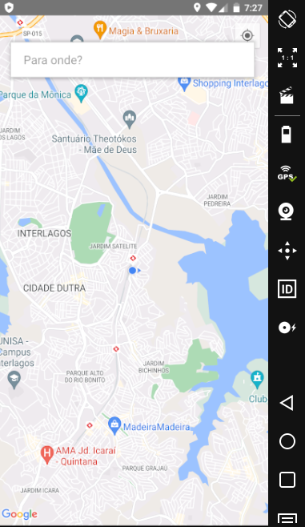
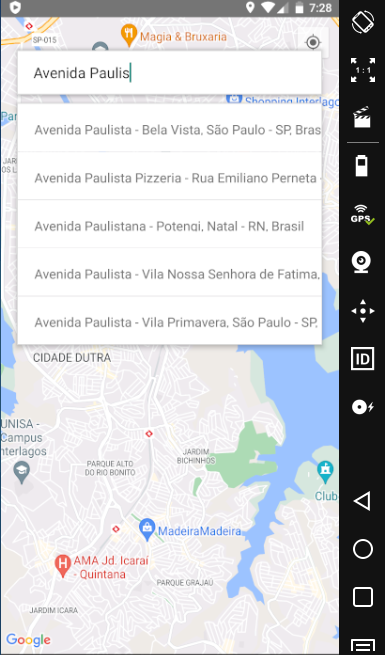
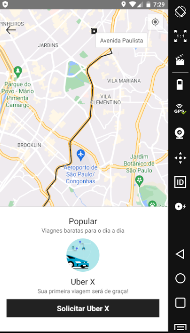

# Uber React Native

# Descrição
Este projeto consiste em desenvolver um app em React Native recriando a interface do passageiro no Uber. 
Foi criado um aplicativo react native utilizando:
<ul>
  <li>API react-native-maps para projetar o mapa na tela do usuário.</li>
  <li>API @react-native-community/geolocation para pegar a localização atual do usuário e projetar no mapa.</li>
  <li>API react-native-google-places-autocomplete para ajudar o usuário na busca de locais.</li>
  <li>API react-native-maps-directions para mostrar a rota do usuário de seu local até o destino e o tempo do percurso.</li>
  <li>API react-native-geocoding para apresentar o nome dos locais de saída e destino para o usuário.</li>
</ul>
  

# Layout do Projeto

  
  
  

# Tecnologias Utilizadas

<ul>
  <li>React Native</li>
  <li>JavaScript</li>
  <li>Android Studio</li>
  <li>Visual Studio Code</li>
</ul>

# Autor
José Ricardo Chies Gonçalves

LinkedIn:
https://www.linkedin.com/in/ricardo-chies-087557216/

E-mail:
chies.dev@gmail.com
